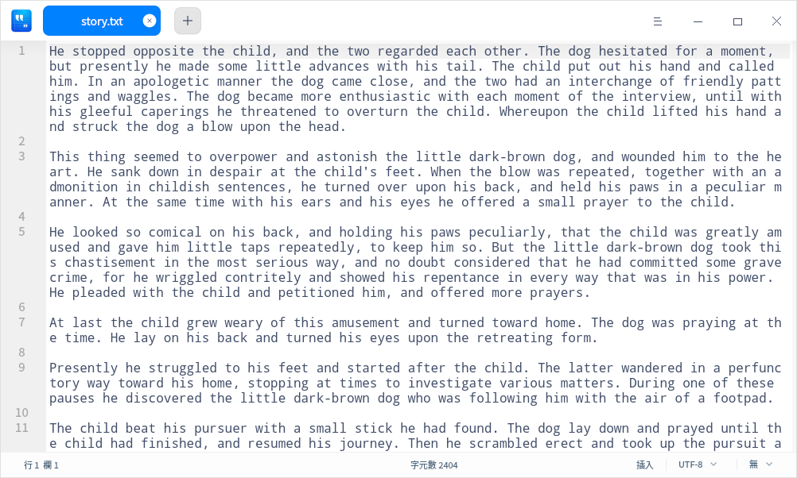
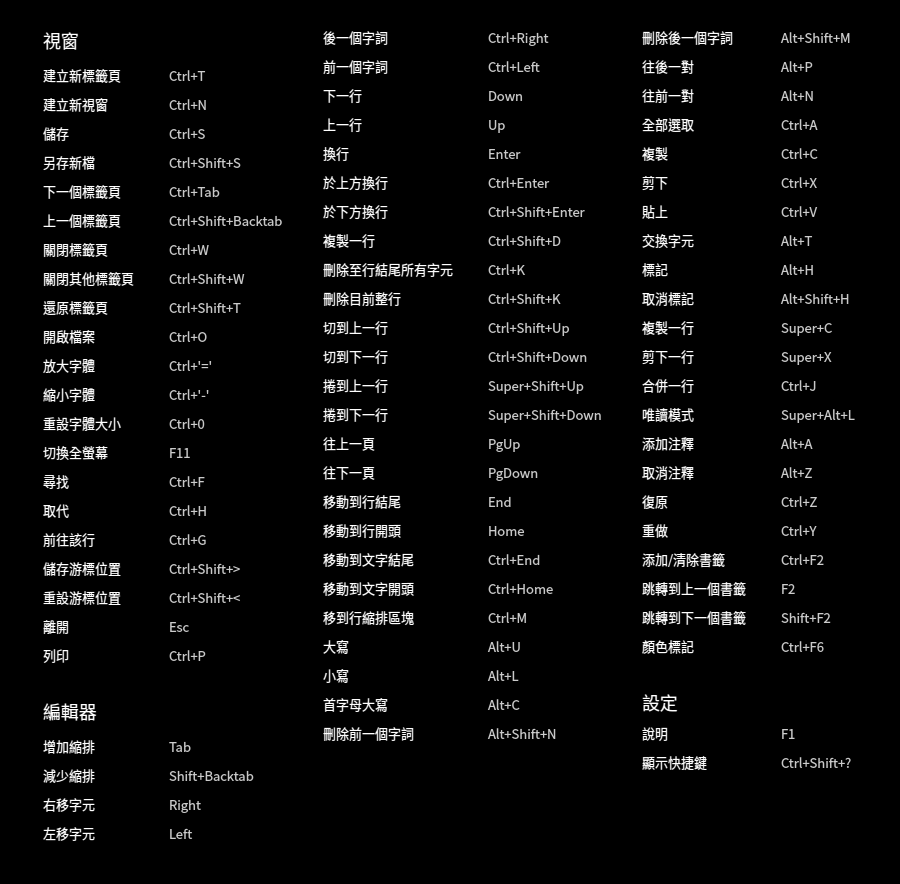
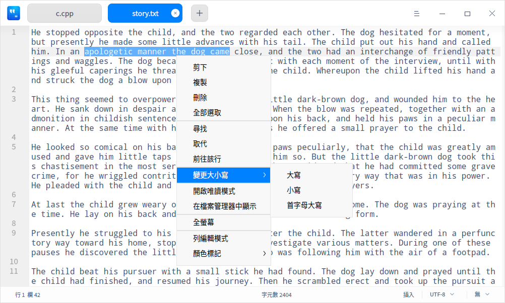
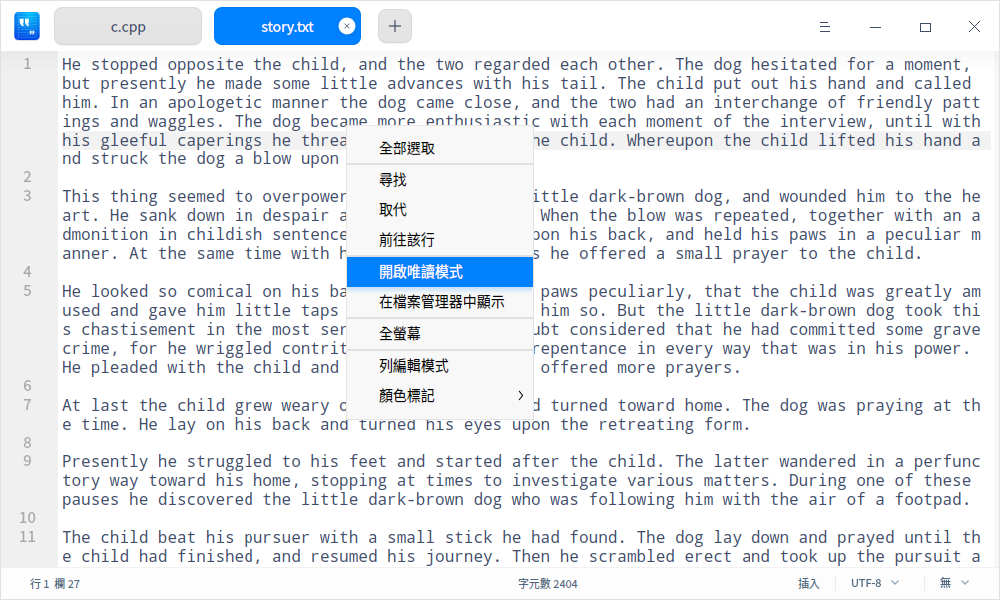
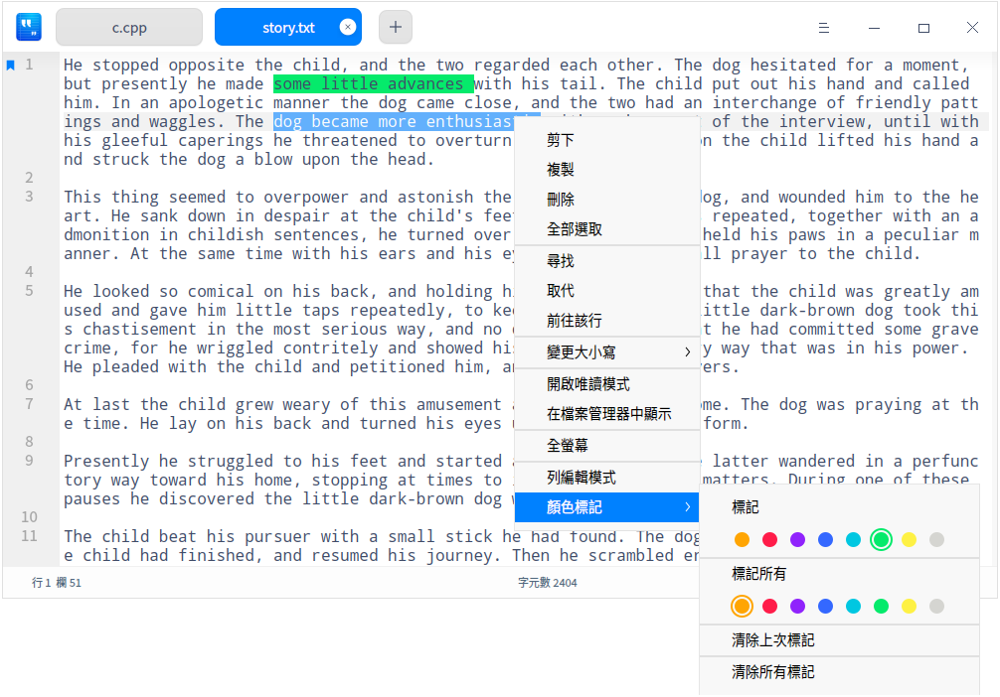

# 文字編輯器|deepin-editor|

## 概述

文字編輯器是一個簡單的文字編輯工具。您可以用它書寫簡單的文字檔案，也可以使用它的進階特性，讓它成為一個程式碼編輯工具，支援程式碼語法突顯。

## 使用入門

### 執行文字編輯器

1.  單擊任務欄上的啟動器圖示 ，進入啟動器介面。
2. 上下滾動滑鼠滾輪瀏覽或透過搜尋，找到文字編輯器圖示并打開。
3. 右鍵單擊，您可以：

 - 單擊 **建立桌面捷徑**，在桌面建立捷徑。
 - 單擊 **釘選到Dock**，將應用程式固定到Dock。
 - 單擊 **開機啟動**，將應用程式添加到開機啟動項，在電腦開機時自動執行該應用。

### 關閉文字編輯器

- 在文字編輯器介面，單擊 ，關閉文字編輯器。
- 在文字編輯器介面，單擊主選單 > **離開**， 關閉文字編輯器。
- 在Dock上右鍵單擊 ，選擇 **全部關閉**， 關閉文字編輯器。

### 查看快捷鍵

在文字編輯器介面，使用快捷鍵 **Ctrl + Shift + ?** 打開快捷鍵預覽介面。您也可以在設定介面查看快捷鍵。熟練地使用快捷鍵，將大大提升您的操作效率。

## 基本操作

### 管理標籤頁

- 建立標籤頁/視窗

  - 單擊標籤頁上的  或  > **建立新標籤頁** 或使用快捷鍵 **Ctrl + T** 建立一個新的標籤頁。
  - 單擊 > **建立新視窗** 或使用快捷鍵 **Ctrl + N** 建立一個新的視窗。

- 調整標籤頁/視窗

  - 拖曳同一視窗內的標籤頁重新排序。
  - 滾動滑鼠切換同一視窗內的標籤頁。
  - 移出標籤頁建立一個新的視窗，或者從一個視窗移到另外一個視窗中。

- 關閉標籤頁/視窗

  當視窗中僅有一個標籤頁時，關閉標籤頁的同時也會關閉視窗。

  - 使用 快捷鍵**Ctrl + W** 關閉目前標籤頁。
  - 單擊標籤頁上的  按鈕或者單擊滑鼠中鍵，關閉目前標籤頁。
  - 右鍵單擊標籤頁，選擇 **關閉標籤頁** 、**關閉其他標籤頁** 或 **更多關閉方式** 來關閉標籤頁。

  > 說明：如果您的檔案發生了變化而沒有儲存，文字編輯器會在關閉前提示您儲存更改。

### 開啟檔案

您可採用以下方式開啟一個或同時開啟多個文字檔案，選中的檔案將會在新標籤頁開啟：

- 直接拖動檔案到文字編輯器介面或其圖示上。
- 右鍵單擊文件，選擇 **打開方式** > **文字編輯器**。選擇文字編輯器為預設打開程式後，可直接雙擊打開。
- 在文字編輯器介面，單擊  > **打開文件** 或使用快捷鍵 **Ctrl + O**，在彈出的視窗中選擇文件。

### 儲存檔案
- 單擊 > **儲存**，儲存檔案。

- 使用快捷鍵 **Ctrl + S** 或 **Ctrl + Shift + S** 儲存目前檔案。

### 列印檔案

在文字編輯器中使用列印，需要您連接並配置好印表機。

1.  單擊  > **列印** 或使用快捷鍵 **Ctrl + P** 打開列印預覽。
2. 在列印預覽介面，您可以預覽檔案，選擇印表機並設定列印頁面。
3. 在列印預覽介面，單擊 **進階設定**，可配置紙張大小、列印方式等相關參數。
4. 單擊 **列印** 即可將檔案發送到印表機列印。

## 編輯文字

### 移動游標

除了使用方向鍵和滑鼠單擊移動游標，您還可以使用以下快捷鍵迅速移動游標：

| 功能   |  快捷鍵 |
| --------------- | ------------ |
| 儲存游標位置 | Ctrl + Shift + > |
| 重設游標位置（跳轉到上次游標儲存的位置） | Ctrl + Shift + < |
| 後一個字詞 （游標向右跳過一個字詞） | Ctrl + 右方向鍵 |
| 前一個字詞 （游標向左跳過一個字詞） | Ctrl + 左方向鍵 |
| 移動到行結尾 | End |
| 移動到行開頭 | Home |
| 移動到文字結尾 | Ctrl + End |
| 移動到文字開頭 | Ctrl + Home |
| 移到行縮排區塊 | Ctrl + M |
| 往後一對 （游標移動到右括號的後面） | Alt + P |
| 往前一對（游標移動到左括號的前面） | Alt + N |

### 切換大小寫

此功能幫助您更改選中文字的大小寫。您可以將選中文字全部改為小寫字母，大寫字母，或者首字母大寫。

1. 選中待更改的文字內容。
2. 單擊右鍵，選擇 **變更大小寫**。
3. 選擇 **大寫**/**小寫**/**首字母大寫** 選項。文字格式的更改會立即生效。

您也可以使用快捷鍵 **Alt + U/L/C** 迅速切換大小寫。

### 突顯文字

文字編輯器支援突顯不同類型的文字。
單擊底部狀態欄最右側的三角符號， 選擇某種文字類型。若文字中有相應內容則會自動突顯。

### 刪除文字
除了向左或向右逐個刪除字元外，您還可以使用以下快捷鍵迅速刪除字元：

| 功能   |  快捷鍵 |
| --------------- | ------------ |
| 刪除至行結尾所有字元 | Ctrl + K |
| 刪除目前整行 | Ctrl + Shift + K |
| 刪除前一個字詞 | Alt + Shift + N |
| 刪除後一個字詞 | Alt + Shift + M |

### 復原操作

如果在文字編輯時發生誤操作，您可以使用快捷鍵 **Ctrl + Z** 撤銷操作， 或者在右鍵選單中選擇 **復原**。

### 尋找文字

1. 單擊 > **尋找** 或使用快捷鍵 **Ctrl + F** ，打開尋找視窗。
2. 在尋找視窗中輸入您想要搜尋的文字。
3. 單擊 **上一個**、**下一個** 逐個尋找，或使用 **Enter** 鍵尋找下一個匹配項。
4. 按下 **Esc** 鍵或單擊關閉按鈕，關閉尋找視窗。

> 竅門：選中一段文字，再選擇尋找，則這段文字會自動出現在尋找視窗中。

### 取代文字
1. 單擊 > **取代** 或使用快捷鍵 **Ctrl + H** 可以在下方打開取代視窗。
2. 在取代為視窗中輸入您想要取代的文字以及新文字。
3. 單擊 **取代** 逐個取代，單擊 **取代剩餘部份**、**全部取代** 一次性取代剩餘的或所有的匹配文字。單擊 **跳過** 不取代目前匹配的文字。
4. 按下 **Esc** 鍵或單擊關閉按鈕，關閉取代視窗。

### 前往該行
使用該功能可以迅速前往到任一行。

在右鍵選單中選擇 **前往該行** 或者使用快捷键 **Ctrl + G**，輸入行號即可前往到相應行。

### 編輯行

您可以使用以下快捷鍵迅速編輯行：

| 功能   |  快捷鍵 |
| ------------ | ------------ |
| 於上方換行（在上方插入一行） | Ctrl + Enter |
| 於下方換行（在下方插入一行） | Ctrl + Shift + Enter |
| 複製一行 | Ctrl + Shift + D |
| 切到上一行（與上一行交換位置） | Ctrl + Shift + Up |
| 切到下一行（與下一行交換位置） | Ctrl + Shift + Down |
| 捲到上一行 | Super + Shift + Up |
| 捲到下一行 | Super + Shift + Down |
| 標記 | Alt + H |
| 取消標記 | Alt + Shift + H |
| 複製一行 | Super + C |
| 剪下一行 | Super + X |
| 合併一行 | Ctrl + J |

### 開啟/關閉唯讀模式

1. 使用文字編輯器打開檔案，單擊右鍵，選擇 **開啟唯讀模式**。
2. 在唯讀模式下，單擊右鍵，選擇 **關閉唯讀模式**。

### 列编辑
在文字編輯器介面，按住鍵盤上的 **Alt** 鍵不放，滑鼠左鍵單擊多列啟動列編輯模式，為多行程式碼同時編輯相同的內容，提高工作效率。

### 顏色標記

在文字編輯器介面，滑鼠右鍵選擇 **顏色標記**，在其下拉選單中進行選擇。

   - **標記**：對某一行或某一段文字內容添加顏色標記；有8種顏色按鈕可供選擇。
      + 將游標定在某一行，標記目前所在的行。
      + 選中一段文字內容後，標記選中的文字內容。
   - **標記所有**：將文字內容全部標記或對已選中的文字內容，在全文中標記匹配項；有8種顏色按鈕可供選擇。
      + 將游標定在任意一行，將文字內容全部標記。
      + 選中一段文字內容，在全文中標記匹配項。
   - **清除上次標記**：清除上次標記操作。
   - **清除所有標記**：清除目前所有標記。

### 書籤管理

在文字編輯器設定介面，勾選**顯示書籤圖標**後，您可以為任意一行的文字內容添加書籤，將滑鼠指標移至左側欄任意一行處會顯示 ，添加成功後該行的書籤圖示會變為藍色填充的圖示 。

- 添加書籤

  + 滑鼠左鍵單擊 ，為該行添加書籤。
  + 滑鼠右鍵單擊 ，選擇 **添加書籤**，為該行添加書籤。
  + 將游標定在文字中任意一行，使用快捷鍵 **Ctrl + F2** 為該行添加書籤。

- 刪除書籤

  + 滑鼠左鍵單擊已填充顏色的書籤圖示，直接刪除該行書籤。
  + 滑鼠右鍵單擊已填充顏色的書籤圖示，選擇 **清除書籤**，刪除該行書籤。
  + 滑鼠右鍵單擊書籤圖示，選擇 **清除所有書籤**，刪除該文字的全部書籤。

   >說明：滑鼠移到左側行號前面才會顯示書籤圖示，移出書籤區域，書籤圖示消失。添加書籤後，該圖示一直顯示。 

### 注釋管理

在文字編輯器介面，您可以對副檔名為cpp 、java 、py等程式碼類型的檔案進行添加注釋的操作。

- 添加注釋
    + 選中一段文字內容，單擊右鍵並選擇 **添加注釋**。
    + 選中一段文字內容，使用快捷鍵 **Alt + A** 添加注釋。
    
- 取消注釋
    + 選中一段已添加注釋的文字內容，單擊右鍵並選擇 **取消注釋**。
    + 選中一段已添加注釋的文字內容，使用快捷鍵 **Alt + Z** 取消注釋。

   >說明：支援不同程式碼語言的注釋，具體以實際為主。例如C，C#，Java注釋符號為 //，Python 注釋符號為 #。

## 主選單

在主選單中，您可以 [建立新視窗](#管理標籤頁)、[建立新標籤頁](#開啟檔案)、尋找取代內容、儲存檔案、切換視窗主題、查看說明手冊，了解文字編輯器的更多訊息。

### 設定
您可以對基本訊息、快捷鍵和進階訊息進行設定。

#### 基本設定

1. 單擊 > **設定**。
2. 在基本設定選項，您可以選擇：
   - 設定字體樣式，選擇字體和字體大小。
   - 勾選 **文字換行**，在編輯區自動換行。
   - 勾選 **顯示代碼摺疊標誌**，在左側欄顯示或者按鈕，右鍵單擊按鈕選擇摺疊/展開目前層次或所有層次。
   - 勾選 **顯示行號**，在左側欄顯示行號。
   - 勾選**當前行高亮**，游標所在的行突顯顯示。
    - 勾選 **顯示書籤圖示**，在左側欄顯示書籤圖示。
   - 勾選 **顯示空白制符/制表符**，顯示文字中的空白字符和制表符，您也可以手動輸入或刪除空白字符和制表符。
   > 竅門：您還可以使用 **Ctrl + 「+」/ 「-」** 來調節文字編輯器的預設字號。使用 **Ctrl + 0** 復原預設字號。

#### 快捷鍵設定

1. 單擊 > **設定**，在 **快捷鍵** 選項查看目前快捷鍵。
2. 選擇一種按鍵映射。
3. 單擊快捷鍵編輯框，可以自訂快捷鍵。

   > 說明: 按鍵映射允許您選擇某一種鍵盤快捷鍵。您可以使用標準快捷鍵、Emacs快捷鍵、或自訂快捷鍵，以符合您的使用習慣。

#### 進階設定

1. 單擊 > **設定**。
2. 在 **進階設定** 選項，您可以設定：
   - 視窗大小為：一般、最大或全螢幕。
   - Tab寬度：Tab縮排所占用的空間大小。

   > 注意：單擊設定介面上的 **還原預設值**，會將所有設定還原到預設狀態。

### 主題

視窗主題包含亮色主題、暗色主題和系統主題。

1. 在文字編輯器介面，單擊。
2. 單擊 **主題**，選擇一個主題顏色。

### 說明

查看說明手冊，進一步了解和使用文字編輯器。

1. 在文字編輯器介面，單擊 。
2. 單擊 **說明**。
3. 查看文字編輯器的說明手冊。

### 關於

1. 在文字編輯器介面，單擊 。
2. 單擊 **關於**。
3. 查看文字編輯器的版本和介紹。

### 離開

1. 在文字編輯器介面，單擊 。
2. 單擊 **離開**。